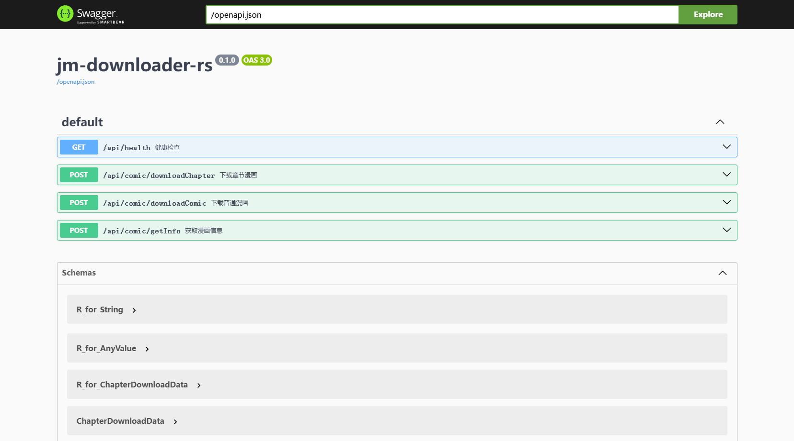

<h1 align="center">📚 jm-downloader-rs</h1>

<p align="center">
  <strong>JMComic 漫画下载器 · Rust Web 服务 · 支持导出 PDF</strong>
</p>

<div align="center">
  
</div>
<br>

<div align="center">
  <a href="https://github.com/bling-yshs/jm-downloader-rs/stargazers"></a>
  <a href="https://github.com/bling-yshs/jm-downloader-rs/releases/latest"></a>
  <a href="https://github.com/bling-yshs/jm-downloader-rs/releases"></a>
  <a href="https://github.com/bling-yshs/jm-downloader-rs/blob/main/LICENSE"></a>
</div>
<br>

## ✨ 项目简介

jm-downloader-rs 是一个使用 Rust 和 Rocket 框架构建的 JMComic 禁漫下载的 Web 服务。它提供 RESTful API 来获取漫画信息、下载章节图片，支持将图片合并为 PDF 文件。

服务器默认运行在 `http://0.0.0.0:8000`

## 🚀 功能特性

- 📖 **漫画信息获取** - 获取漫画标题、作者、简介、章节列表等完整信息
- 📥 **章节图片下载** - 支持批量下载多个章节的图片，自动创建目录结构
- 📄 **PDF 合并生成** - 支持将下载的图片合并为 PDF 文件，可选密码加密
- 🔐 **自动会话管理** - 检测到会话失效时自动重新登录，无需手动干预
- ⚡ **并发下载优化** - 可配置并发数（默认 32），平衡下载速度与资源占用
- 🔄 **自动重试机制** - 网络请求失败时自动重试，提高下载成功率
- 🗑️ **过期自动清理** - 下载完成后可设置自动删除时间，节省存储空间
- 📚 **API 文档集成** - 内置 Swagger UI 文档（访问 `/docs`）

## 🖼️ 应用截图

<div align="center">
  
</div>

## 🐳 Docker 部署

### 拉取镜像

```bash
docker pull blingyshs/jm-downloader-rs:latest
```

### 运行容器

```bash
docker run -d \
  --restart=unless-stopped \
  --name=bridge-jm-downloader-rs \
  --net=bridge \
  -p 8000:8000 \
  -e JM_USERNAME=your_username \
  -e JM_PASSWORD=your_password \
  -e TZ=Asia/Shanghai \
  blingyshs/jm-downloader-rs:latest
```

### 参数说明

| 参数 | 说明 |
|:---|:---|
| `-p 8000:8000` | 端口映射，可修改为其他端口如 `-p 20180:8000` |
| `-e JM_USERNAME` | JMComic 用户名（必需） |
| `-e JM_PASSWORD` | JMComic 密码（必需） |
| `-e TZ` | 时区设置（可选，默认 UTC） |
| `-e JM_API_DOMAIN` | API 域名（可选） |
| `-e JM_IMAGE_DOMAIN` | 图片域名（可选） |
| `-e JM_IMG_CONCURRENCY` | 并发下载数（可选，默认 32） |

部署完成后，访问 `http://localhost:8000/docs` 查看 API 文档。

## 📡 API 端点

| 端点 | 方法 | 说明 |
|:---|:---:|:---|
| `/api/comic/getInfo` | POST | 获取漫画信息（标题、类型、作者、章节列表等） |
| `/api/comic/downloadChapter` | POST | 下载章节漫画（支持批量下载多个章节） |
| `/api/comic/downloadComic` | POST | 下载普通漫画（可选合并为 PDF） |
| `/api/health` | GET | 健康检查 |
| `/download/*` | GET | 静态文件服务（访问下载的图片） |
| `/docs` | GET | Swagger API 文档 |

### 响应格式

所有 API 返回统一的响应格式：

```json
{
  "code": "0",
  "success": true,
  "data": { ... },
  "message": null,
  "time": "2025-01-20T14:50:12+08:00"
}
```

## 🛠️ 技术栈

| 类型 | 技术 |
|:---:|:---:|
| 🦀 编程语言 | Rust |
| 🚀 Web 框架 | Rocket 0.5.1 |
| 🌐 HTTP 客户端 | reqwest 0.12 (支持重试) |
| 🖼️ 图片处理 | image 0.25 |
| 📄 PDF 生成 | printpdf 0.7 |
| 🔐 加密解密 | aes 0.8, md5 0.8, base64 0.22 |
| ⚡ 异步运行时 | tokio 1.x |
| 📝 日志系统 | log4rs 1.4.0 |
| 📚 API 文档 | rocket_okapi 0.9 (Swagger) |

## 📂 项目结构

```
jm-downloader-rs/
├── src/                           # 🦀 Rust 源码
│   ├── main.rs                    # 🚀 应用入口，配置路由和全局状态
│   ├── jm_client.rs               # 🌐 JMComic API 客户端
│   ├── global_client.rs           # 🔄 全局客户端管理器（自动会话管理）
│   ├── handlers.rs                # 📡 API 路由处理器
│   ├── image_processor.rs         # 🖼️ 图片处理模块（下载、拼接、转换）
│   ├── models.rs                  # 📦 数据模型定义
│   ├── config.rs                  # ⚙️ 环境变量配置
│   └── lib.rs                     # 📚 统一响应结构和错误处理
├── log4rs.yaml                    # 📝 日志配置文件
├── Cargo.toml                     # 📦 Rust 依赖配置
├── download/                      # 📥 下载目录（自动创建）
└── logs/                          # 📝 日志目录（自动创建）
```

## 🔨 开发指南

### 环境要求

| 环境 | 版本要求 |
|:---:|:---:|
| 🦀 Rust | 1.89+ |

### 本地开发

```bash
# 📦 克隆项目
git clone https://github.com/bling-yshs/jm-downloader-rs.git
cd jm-downloader-rs

# ⚙️ 配置环境变量
export JM_USERNAME=your_username
export JM_PASSWORD=your_password

# 🚀 运行开发版本
cargo run

# 🔍 代码检查
cargo clippy

# 🏗️ 构建生产版本
cargo build --release
```

## 🤝 贡献指南

欢迎提交 Issue 和 Pull Request！

## 🙏 致谢

感谢以下开源项目：

- [lanyeeee/jmcomic-downloader](https://github.com/lanyeeee/jmcomic-downloader) - 提供了参考实现

## 📄 许可证

本项目采用 [GPL-3.0](LICENSE) 开源许可证。
